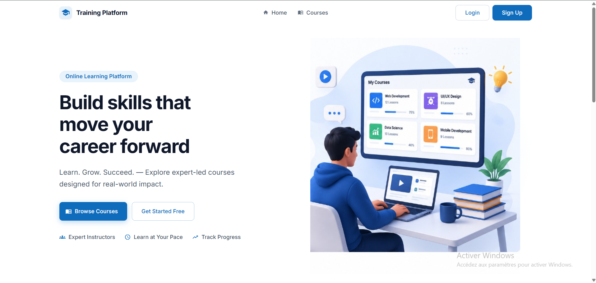

🎓 Training Platform

  

<h3 align="center">Intelligent Learning & Professional Training Platform</h3>

  A full-stack e-learning platform combining <b>Angular</b>, <b>Spring Boot</b>,
  <b>Machine Learning</b>, <b>Docker</b> and <b>Continuous Integration</b>.

  
  
  
  
  
  
  

✨ Overview

Training Platform is an intelligent online learning platform designed to manage professional training from course creation to learner progress and personalized recommendations.

The platform provides dedicated experiences for:

👨‍💼 Administrators — platform and user management

👨‍🏫 Trainers — course, chapter, lesson and student management

👨‍🎓 Learners — course discovery, enrollment, learning and progress tracking

🌍 Visitors — public access to the platform and course catalog

The project also integrates a Machine Learning recommendation system that analyzes learner-related data to suggest relevant courses.

🚀 Highlights

Area

Main capabilities

🔐 Authentication

JWT, Google OAuth2, role-based access

👨‍💼 Admin

Users, categories, instructor requests, dashboard

👨‍🏫 Trainer

Courses, chapters, lessons, video management, students

👨‍🎓 Learner

Enrollment, My Courses, learning player, progress

📚 Learning

Video lessons, lesson completion, course progress

🤖 MLA

Dataset-based course recommendation

🌍 Public

Landing page, course catalog, course details

🐳 DevOps

Docker, Docker Compose, Jenkins CI

🧩 Core Modules

🔐 Authentication & Security

Registration and login

JWT authentication

Google OAuth2

Role-based authorization

Password recovery

Email verification

Profile management

Password change

Protected routes and APIs

👨‍💼 Administration

Admin dashboard

User management

Category management

Instructor request management

Profile management

Confirmation dialogs

User feedback and notifications

👨‍🏫 Trainer Workspace

Trainer dashboard

Create, update and delete courses

Publish courses

Manage chapters

Manage lessons

Upload lesson videos

Manage enrolled students

View student details

Trainer profile

👨‍🎓 Learner Experience

Learner dashboard

Browse published courses

Course details

Enrollment

My Courses

Learning player

Lesson completion / uncompletion

Course progress tracking

Learner profile

Personalized recommendations

🤖 Machine Learning

The MLA component focuses on personalized course recommendation.

Recommendation flow

┌───────────────────────┐
│   Learner information │
│   + learning activity │
└───────────┬───────────┘
            │
            ▼
┌───────────────────────┐
│   Dataset preparation │
│   & feature handling  │
└───────────┬───────────┘
            │
            ▼
┌───────────────────────┐
│  Machine Learning     │
│  recommendation model │
└───────────┬───────────┘
            │
            ▼
┌───────────────────────┐
│ Recommendation scores │
└───────────┬───────────┘
            │
            ▼
┌───────────────────────┐
│   Recommended Courses │
│       in Angular      │
└───────────────────────┘

The MLA module is maintained separately in:

mla/
├── dataset/
├── models/
├── notebooks/
└── src/
    ├── api.py
    ├── database.py
    ├── recommender.py
    ├── test_dataset.py
    └── test_recommender.py

🏗️ Architecture

                         ┌─────────────────────────┐
                         │       Angular UI        │
                         │ Admin / Trainer /       │
                         │ Learner / Public        │
                         └────────────┬────────────┘
                                      │
                                   REST API
                                      │
                                      ▼
                         ┌─────────────────────────┐
                         │      Spring Boot        │
                         │   Business & Security   │
                         └───────┬─────────┬───────┘
                                 │         │
                                 │         └──────────────┐
                                 ▼                        ▼
                        ┌────────────────┐       ┌────────────────┐
                        │     MySQL      │       │   Cloudinary   │
                        │   Persistence  │       │ Images/Videos  │
                        └────────────────┘       └────────────────┘
                                 │
                                 │
                                 ▼
                        ┌────────────────┐
                        │ MLA / Python   │
                        │ Recommendation │
                        └────────────────┘

🛠️ Tech Stack

Frontend

Angular

TypeScript

Angular Material

SCSS

Reactive Forms

REST API integration

Backend

Java 21

Spring Boot

Spring Security

Spring Data JPA

Hibernate

JWT

OAuth2 / Google

Jakarta Validation

MySQL

Machine Learning

Python

Pandas

NumPy

Scikit-learn

Recommendation model

Dataset-driven learning

DevOps

Docker

Docker Compose

Jenkins

Continuous Integration

Containerized services

External Services

Cloudinary — media storage

Brevo SMTP — email delivery

Google OAuth2 — authentication

📸 Product Showcase

🌍 Public Experience

<b>Home & Public Course Experience</b>

Home

Browse Courses

Course Details

🔐 Authentication

<b>Authentication & Account Management</b>

Login

Sign Up

Forgot Password

👨‍💼 Admin Workspace

<b>Administration Interface</b>

Dashboard

Manage Users

Categories

Instructor Requests

👨‍🏫 Trainer Workspace

<b>Trainer Interface</b>

Dashboard

Manage Courses

Create Course

Edit Course

My Courses

My Students

Course Details

👨‍🎓 Learner Workspace

<b>Learner Interface</b>

Dashboard

My Courses

Recommendations

👤 Profile

🐳 Run with Docker

Prerequisites

Docker Desktop

Git

Start the platform

docker compose --env-file .env -f docker/docker-compose.yml up -d

Check running containers

docker ps

Stop the platform

docker compose --env-file .env -f docker/docker-compose.yml down

The platform is organized as containerized services for the frontend, backend, MLA and database.

⚠️ Never commit .env files or real credentials to the repository.

🔄 Continuous Integration

The project includes a CI workflow with Jenkins.

The objective is to automatically validate the application when changes are integrated.

CI flow

       Git Push
          │
          ▼
   ┌───────────────┐
   │ Jenkins Start │
   └───────┬───────┘
           │
           ├───────────────┐
           ▼               ▼
   Backend Validation   Frontend Validation
           │               │
           └───────┬───────┘
                   ▼
            Build / Tests
                   │
                   ▼
             CI Result ✅

📂 Repository Structure

training-platform/
│
├── backend/
│   └── training-platform/
│
├── frontend/
│   └── training-platform-ui/
│
├── mla/
│   ├── dataset/
│   ├── models/
│   ├── notebooks/
│   └── src/
│
├── docker/
│   └── docker-compose.yml
│
├── docs/
│   ├── 01-project-vision.md
│   ├── 02-project-scope.md
│   ├── 03-functional-requirements.md
│   ├── 04-non-functional-requirements.md
│   ├── 05-user-stories.md
│   ├── 06-use-cases.md
│   └── screenshots/
│
├── .env
└── README.md

🔒 Security

Security is implemented at both frontend and backend levels.

Backend

Spring Security

JWT authentication

Role-based authorization

Protected endpoints

OAuth2 authentication

Environment-based secrets

Frontend

Route guards

Authentication interceptor

Role-based navigation

Form validation

Secure user feedback

📈 Learning Progress

The learning workflow is:

Browse Courses
      ↓
Course Details
      ↓
Enroll
      ↓
My Courses
      ↓
Learning Player
      ↓
Complete Lessons
      ↓
Course Progress
      ↓
Course Completed ✅

The learner can track lesson completion and overall course progress directly from the platform.

📚 Documentation

Project documentation is available in the docs/ directory:

Project Vision

Project Scope

Functional Requirements

Non-Functional Requirements

User Stories

Use Cases

🎯 Academic Objectives

The project demonstrates the integration of:

Frontend Engineering + Backend Development + Machine Learning + DevOps

with the required technologies:

Angular
   +
Spring Boot
   +
Machine Learning
   +
Docker
   +
Continuous Integration

🔮 Future Improvements

Possible future evolutions include:

Advanced learner analytics

More sophisticated recommendation models

Online quizzes and assessments

Certifications and digital badges

Real-time learning sessions

Expanded automated testing

Continuous deployment

Cloud deployment

Advanced observability and monitoring

👤 Author

Khalil Dridi

Full-Stack Developer

Project: Training Platform
Type: Academic Integrated Project

  <b>Built with Angular • Spring Boot • Machine Learning • Docker • Jenkins</b>

