# 🎓 Training Platform

<p align="center">
  
</p>

<h2 align="center">Intelligent Learning & Professional Training Platform</h2>

<p align="center">
  A full-stack learning platform that connects <strong>learners</strong>, <strong>trainers</strong> and <strong>administrators</strong> through course management, learning workflows and personalized recommendations.
</p>

<p align="center">
  
  
  
  
  
  
  
</p>

<p align="center">
  <a href="#-overview">Overview</a> •
  <a href="#-features">Features</a> •
  <a href="#-showcase">Showcase</a> •
  <a href="#-architecture">Architecture</a> •
  <a href="#-getting-started">Getting Started</a> •
  <a href="#-documentation">Documentation</a>
</p>

---

## ✨ Overview

**Training Platform** is a modular e-learning application designed to manage the complete professional training lifecycle — from course creation and content delivery to enrollment, progress tracking and personalized learning recommendations.

The project combines a modern Angular frontend, a Spring Boot REST API, a MySQL database and a Python recommendation service, all packaged with Docker and integrated into a Jenkins-based CI workflow.

### 🎯 Project Goals

- Provide a complete digital learning experience for learners.
- Give trainers the tools to create and manage professional courses.
- Give administrators control over the platform and its users.
- Improve course discovery through personalized recommendations.
- Demonstrate a complete full-stack architecture with containerization and continuous integration.

---

## 👥 User Roles

| Role | Main Responsibilities |
|---|---|
| 👨‍💼 **Admin** | Platform administration, users, categories and instructor requests |
| 👨‍🏫 **Trainer** | Course creation, chapters, lessons, videos and student management |
| 👨‍🎓 **Learner** | Course discovery, enrollment, learning and progress tracking |
| 🌍 **Visitor** | Public home page, course catalog and course details |

---

## 🚀 Features

### 🔐 Authentication & Security

- Registration and login
- JWT authentication
- Google OAuth2 login
- Role-based authorization
- Password recovery
- Email verification
- Profile management
- Password change
- Protected REST endpoints and frontend routes
- Form validation and user feedback

### 👨‍💼 Admin Workspace

- Dashboard
- User management
- Category management
- Instructor request management
- Profile management
- Confirmation dialogs and notifications

### 👨‍🏫 Trainer Workspace

- Trainer dashboard
- Course CRUD
- Course publishing
- Chapter and lesson management
- Video upload
- Student management
- Course and student details
- Profile management

### 👨‍🎓 Learner Workspace

- Public course discovery
- Enrollment
- My Courses
- Learning player
- Lesson completion
- Course progress tracking
- Course completion workflow
- Personalized course recommendations
- Profile management

### 🤖 Machine Learning

The **MLA** module provides personalized course recommendations using learner-related information and learning activity.

```text
Learner Data
      ↓
Dataset Preparation
      ↓
Feature Processing
      ↓
Recommendation Model
      ↓
Recommendation Scores
      ↓
Recommended Courses
```

### ☁️ External Services

- **Cloudinary** — image, document and video storage
- **Brevo SMTP** — email delivery
- **Google OAuth2** — social authentication

---

## 📸 Showcase

The platform is organized around separate experiences for public visitors, administrators, trainers and learners.

### 🌍 Public Experience

<p align="center">
  
  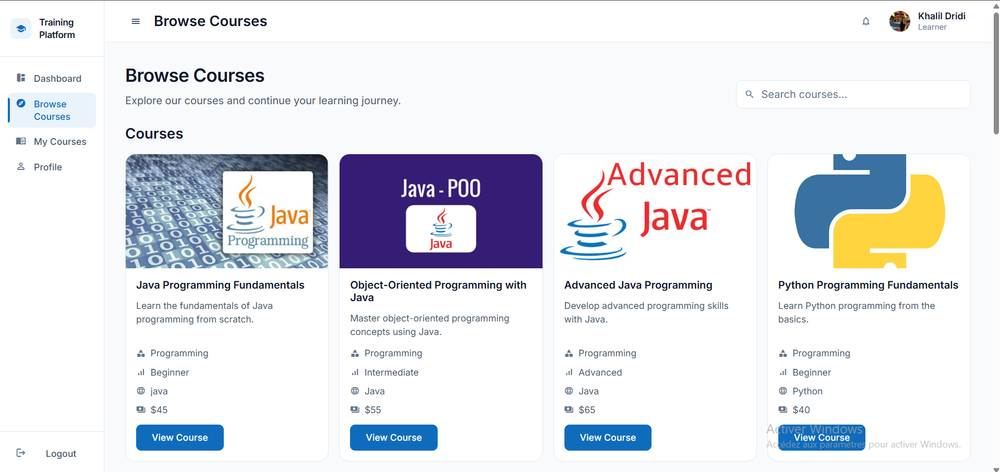
</p>

<p align="center">
  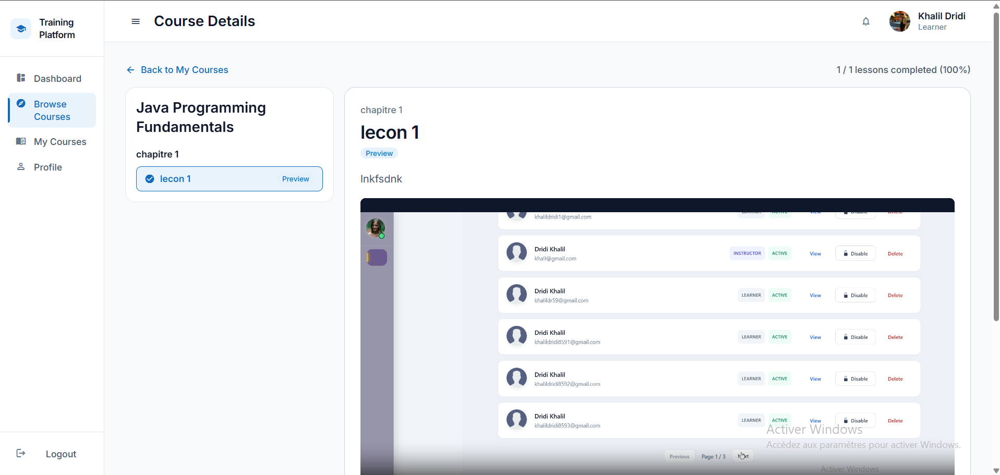
</p>

### 🔐 Authentication

<p align="center">
  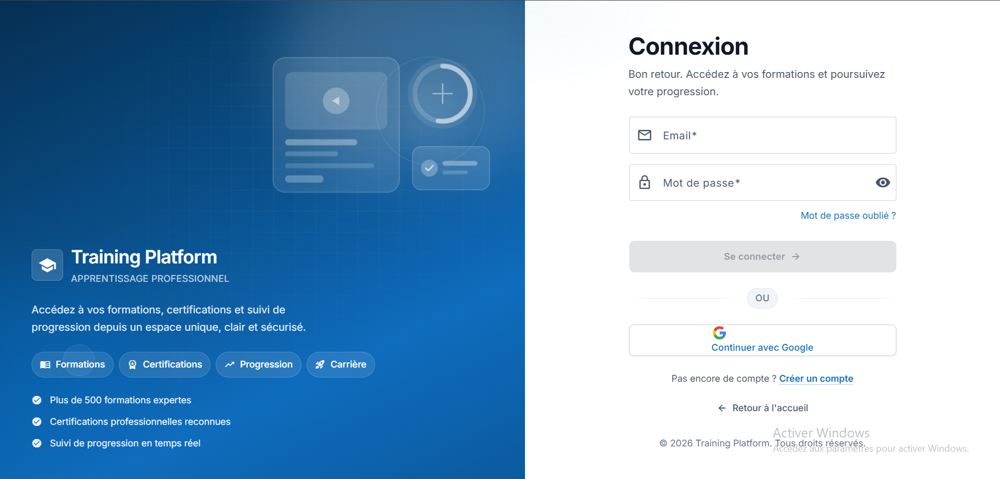
  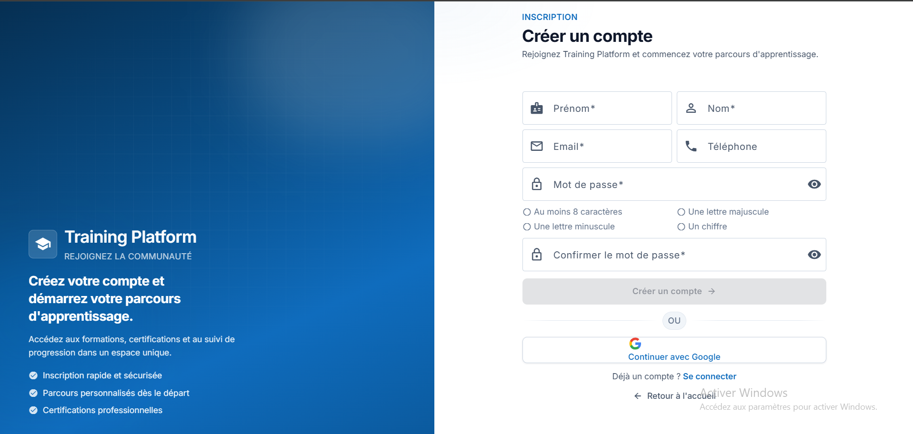
</p>

<p align="center">
  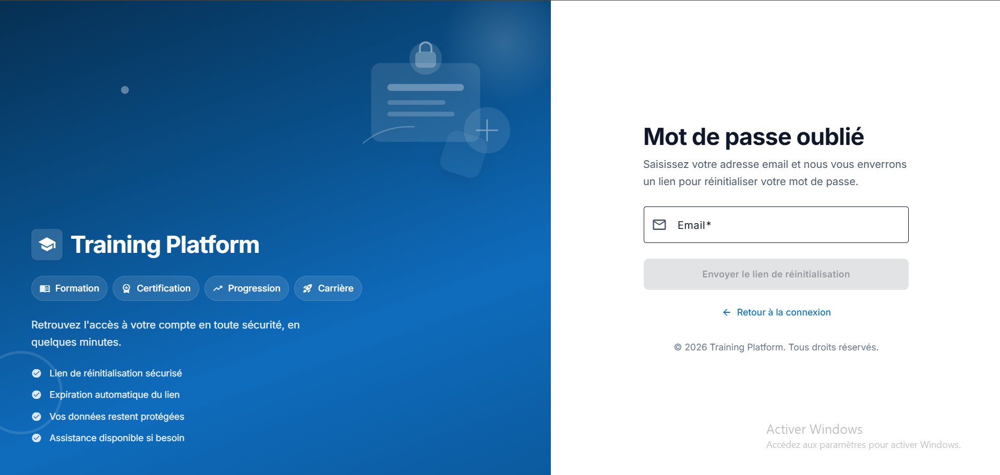
</p>

### 👨‍💼 Admin Workspace

<p align="center">
  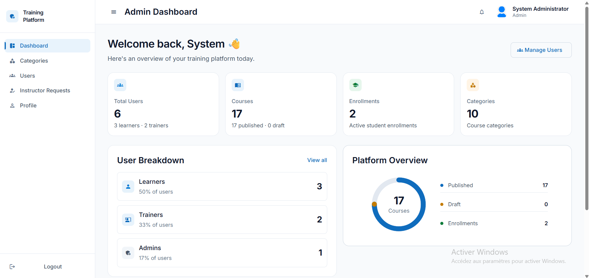
  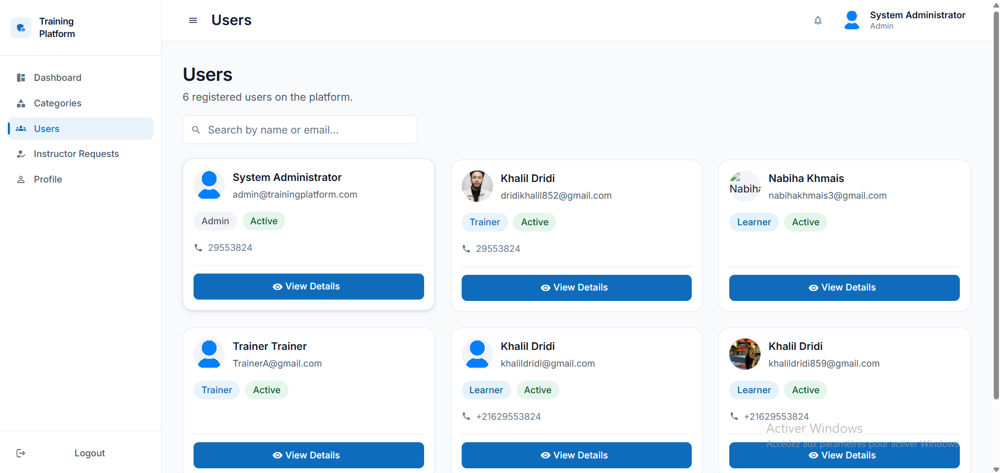
</p>

<p align="center">
  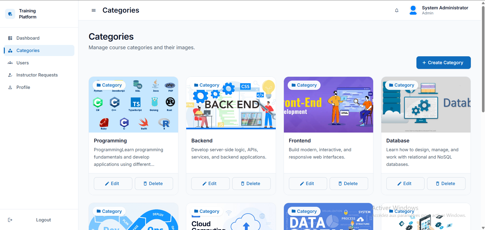
  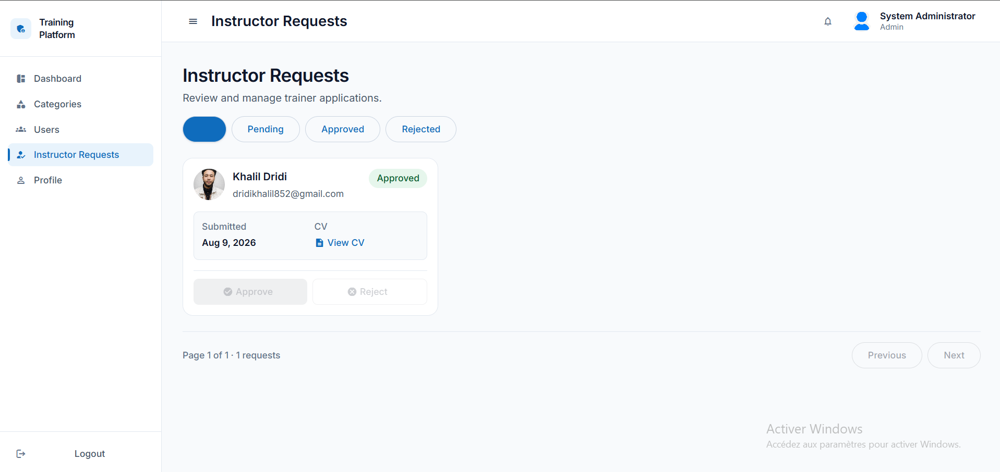
</p>

### 👨‍🏫 Trainer Workspace

<p align="center">
  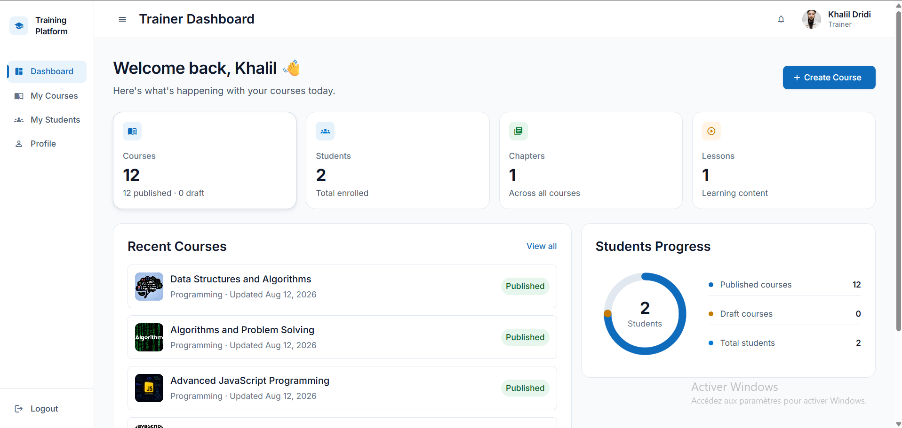
  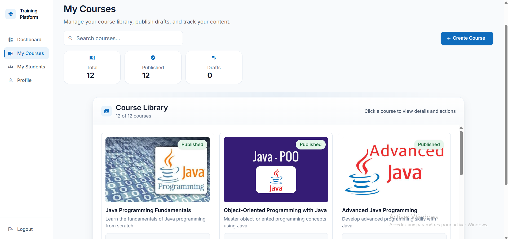
</p>

<p align="center">
  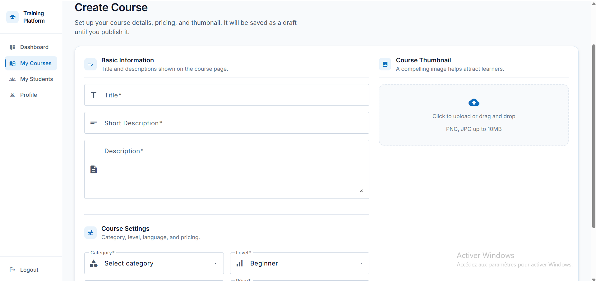
  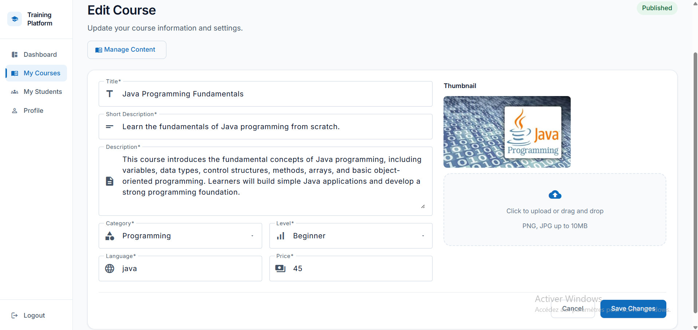
</p>

<p align="center">
  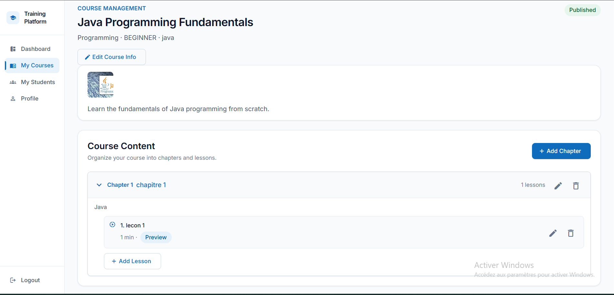
  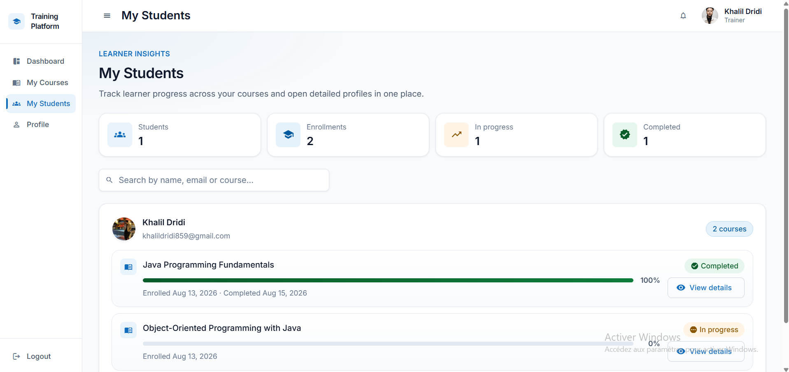
</p>

<p align="center">
  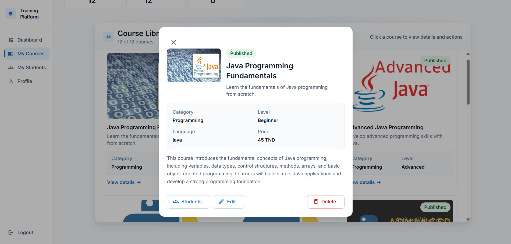
</p>

### 👨‍🎓 Learner Workspace

<p align="center">
  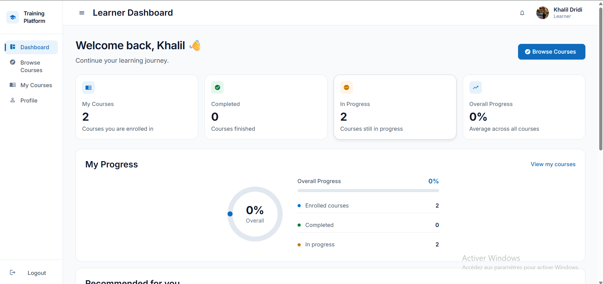
  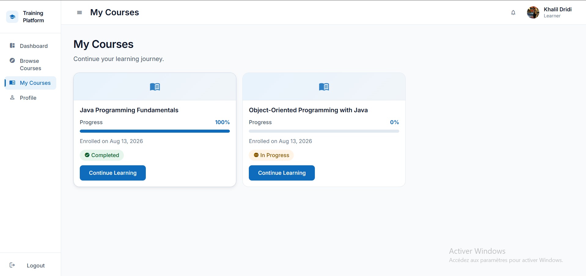
</p>

<p align="center">
  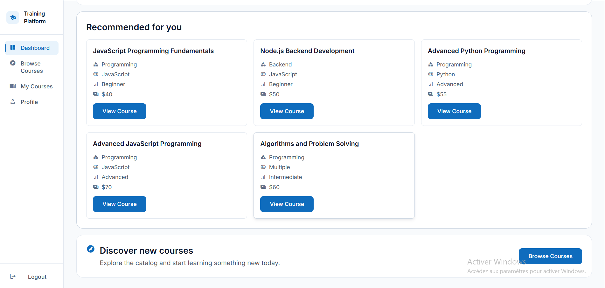
</p>

### 👤 Profile

<p align="center">
  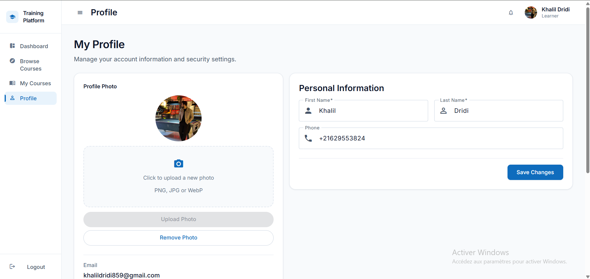
</p>

---

## 🏗️ Architecture

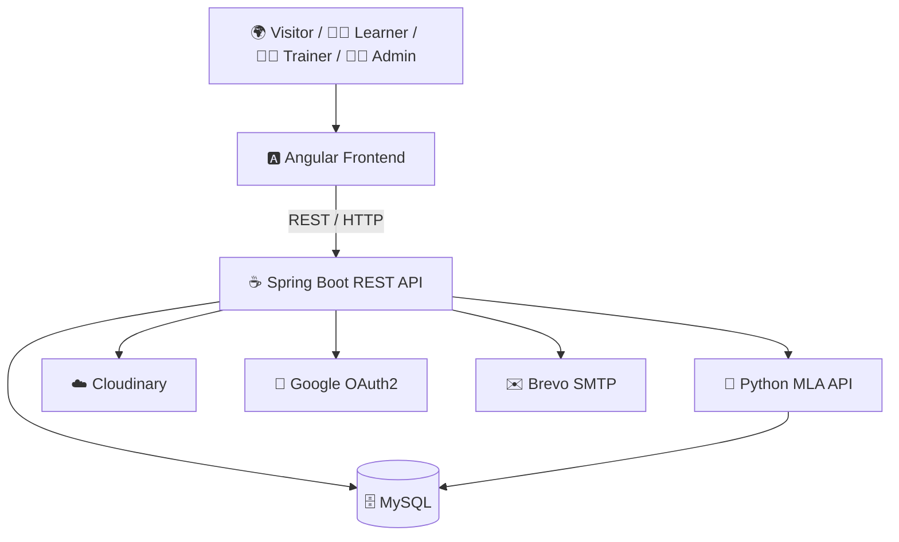

### 🔄 Learning Workflow

```text
Browse Courses
      ↓
Course Details
      ↓
Enroll
      ↓
My Courses
      ↓
Learning Player
      ↓
Complete Lessons
      ↓
Course Progress
      ↓
Course Completed ✅
```

---

## 🛠️ Technology Stack

| Layer | Technologies |
|---|---|
| 🎨 **Frontend** | Angular 20, TypeScript, Angular Material, SCSS, Reactive Forms |
| ⚙️ **Backend** | Java 21, Spring Boot 3.5.4, Spring Security, Spring Data JPA, Hibernate |
| 🗄️ **Database** | MySQL 8.0 |
| 🔐 **Security** | JWT, OAuth2 / Google, role-based authorization |
| 🤖 **MLA** | Python 3.11, Pandas, NumPy, Scikit-learn, FastAPI / Uvicorn |
| 🐳 **DevOps** | Docker, Docker Compose, Jenkins |
| ☁️ **Services** | Cloudinary, Brevo SMTP, Google OAuth2 |
| 🧪 **API Testing** | Postman |

---

## 📁 Repository Structure

```text
training-platform/
├── backend/
│   └── training-platform/
│       ├── src/
│       ├── Dockerfile
│       └── pom.xml
│
├── frontend/
│   └── training-platform-ui/
│       ├── src/
│       ├── Dockerfile
│       ├── nginx.conf
│       └── package.json
│
├── mla/
│   ├── dataset/
│   ├── models/
│   ├── notebooks/
│   ├── src/
│   ├── Dockerfile
│   ├── requirements.txt
│   └── .env.example
│
├── database/
│   └── training_platform.sql
│
├── docker/
│   └── docker-compose.yml
│
├── docs/
│   ├── 01-project-vision.md
│   ├── 02-project-scope.md
│   ├── 03-functional-requirements.md
│   ├── 04-non-functional-requirements.md
│   ├── 05-user-stories.md
│   ├── 06-use-cases.md
│   └── screenshots/
│
├── Jenkinsfile
└── README.md
```

---

## 🚀 Getting Started

### 1. Clone the repository

```bash
git clone https://github.com/khalil-dridi/training-platform.git
cd training-platform
```

### 2. Configure environment variables

The Docker Compose stack expects a local `.env` file at the repository root.

At minimum, the stack uses:

```env
MYSQL_PASSWORD=your_mysql_password
JWT_SECRET=your_jwt_secret
GOOGLE_CLIENT_ID=your_google_client_id
GOOGLE_CLIENT_SECRET=your_google_client_secret
MAIL_USERNAME=your_mail_username
MAIL_PASSWORD=your_mail_password
MAIL_FROM=your_mail_from
CLOUDINARY_CLOUD_NAME=your_cloud_name
CLOUDINARY_API_KEY=your_cloudinary_api_key
CLOUDINARY_API_SECRET=your_cloudinary_api_secret
```

> 🔒 Never commit `.env` files or real credentials.

### 3. Build the application images

The Compose file references project-specific images, so build them before starting the stack:

```bash
docker build -t training-platform-backend:1.7 ./backend/training-platform
docker build -t training-platform-frontend:1.1 ./frontend/training-platform-ui
docker build -t training-platform-mla:1.0 ./mla
```

### 4. Start the platform

```bash
docker compose --env-file .env -f docker/docker-compose.yml up -d
```

### 5. Check running containers

```bash
docker ps
```

### 6. Stop the platform

```bash
docker compose --env-file .env -f docker/docker-compose.yml down
```

---

## 🌐 Local Services

| Service | URL / Port |
|---|---|
| 🅰️ **Frontend** | http://localhost:4200 |
| ☕ **Backend API** | http://localhost:8080 |
| 🤖 **MLA API** | http://localhost:8000 |
| 🗄️ **MySQL** | localhost:3307 → container 3306 |

### 📚 API Documentation

The Spring Boot application exposes OpenAPI documentation through Swagger UI.

```text
http://localhost:8080/swagger-ui.html
```

---

## 🐳 Docker Stack

The project is containerized into four main services:

```text
┌─────────────────────────────────────────────┐
│              Docker Compose                 │
├─────────────────────────────────────────────┤
│ 🅰️ Frontend       :4200                     │
│ ☕ Backend         :8080                     │
│ 🤖 MLA            :8000                     │
│ 🗄️ MySQL          :3307                     │
└─────────────────────────────────────────────┘
```

### Services

| Container | Image | Purpose |
|---|---|---|
| `training-platform-frontend` | `training-platform-frontend:1.1` | Angular application served by Nginx |
| `training-platform-backend` | `training-platform-backend:1.7` | Spring Boot REST API |
| `training-platform-mla` | `training-platform-mla:1.0` | Recommendation API |
| `training-platform-mysql` | `mysql:8.0` | Application database |

---

## 🔄 Continuous Integration

The project includes a **Jenkins** pipeline for continuous integration.

```text
Git Push
   ↓
Jenkins
   ├── Backend validation
   ├── Frontend validation
   ├── MLA validation
   └── Build / Tests
          ↓
      CI Result ✅
```

---

## 🔒 Security

### Backend

- Spring Security
- JWT authentication
- BCrypt password hashing
- Role-based authorization
- Protected endpoints
- OAuth2 authentication
- Environment-based secrets

### Frontend

- Route guards
- Authentication interceptor
- Role-aware navigation
- Form validation
- User notifications

---

## 📚 Documentation

Project documentation is available under `docs/`:

| Document | Description |
|---|---|
| `01-project-vision.md` | Project vision |
| `02-project-scope.md` | Project scope |
| `03-functional-requirements.md` | Functional requirements |
| `04-non-functional-requirements.md` | Non-functional requirements |
| `05-user-stories.md` | User stories |
| `06-use-cases.md` | Use cases |

---

## 🎯 Academic Project

Training Platform demonstrates the integration of:

**Angular + Spring Boot + Machine Learning + MySQL + Docker + Jenkins**

as a complete academic full-stack project.

---

## 🔮 Future Improvements

- Advanced learner analytics
- More sophisticated recommendation models
- Online quizzes and assessments
- Certifications and digital badges
- Real-time learning sessions
- Expanded automated testing
- Continuous deployment
- Cloud deployment
- Monitoring and observability

---

## 👤 Author

<p align="center">
  <strong>Khalil Dridi</strong><br>
  Full-Stack Developer<br><br>
  <strong>Training Platform</strong><br>
  Academic Integrated Project
</p>

<p align="center">
  Angular • Spring Boot • Machine Learning • Docker • Jenkins
</p>

---

<p align="center">
  <strong>Built with ambition, clean architecture and a focus on real-world learning experiences.</strong>
</p>
